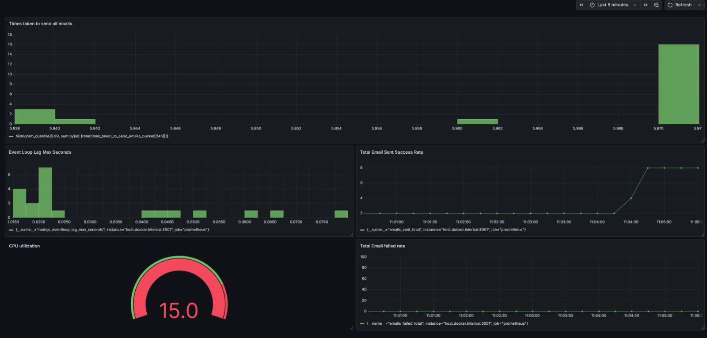

Microservices Architecture with Kafka, Prometheus, and Grafana
Overview

This document describes a microservices setup using Apache Kafka for messaging and Prometheus + Grafana for monitoring. This architecture is suitable for scalable, event-driven applications.

``` bash
Architecture Diagram
+------------------+       +------------------+
|  Microservice A  |       |  Microservice B  |
|  (Producer)      | ----> |  (Consumer)      |
+------------------+       +------------------+
         |                         |
         |                         |
         v                         v
       +------------------------------+
       |         Kafka Cluster         |
       |  (Topics & Partitions)       |
       +------------------------------+
                      |
                      v
               +--------------+
               | Prometheus   |
               | (Metrics)    |
               +--------------+
                      |
                      v
               +--------------+
               | Grafana      |
               | (Visualization) |
               +--------------+
```

Kafka Email Worker

This project demonstrates a Node.js email worker integrated with Apache Kafka, Kafka UI, and Prometheus for metrics tracking. Users can push email jobs to Kafka topics, and a consumer service sends the emails and exposes metrics for monitoring.

Features

Publish email jobs to Kafka (email-jobs topic)

Kafka consumer to send emails using Nodemailer

Prometheus metrics for:

Total emails sent

Total emails failed

Time taken per email

Kafka UI for monitoring brokers, topics, and consumers

Dockerized setup for Kafka and Kafka UI

Requirements

Docker & Docker Compose

Node.js >= 18

Gmail account for SMTP (or any email provider)

Setup
1. Clone repository
git clone <your-repo-url>
cd <repo-folder>
2. Create .env file
SMTP_USER=your-email@gmail.com
SMTP_PASS=your-app-password
3. Start Kafka and Kafka UI
Option 1: Using Docker network
# Create network
docker network create kafka-net

# Run Kafka
docker run -d --name kafka --network kafka-net -p 9092:9092 apache/kafka:latest

4. Install Node.js dependencies
npm install
5. Start Node.js API & Consumer
# API for pushing users
node api.js

# Consumer for sending emails
node consumer.js